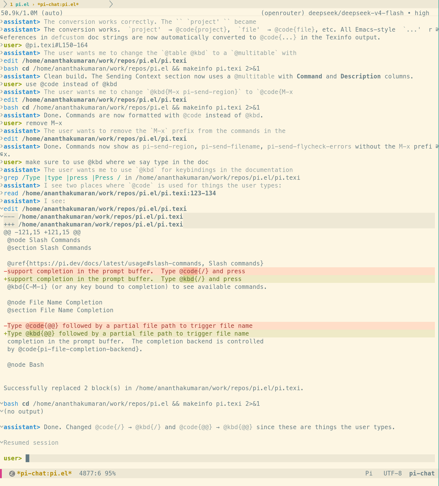

# Pimacs

An Emacs client for [Pi Coding Agent](https://pi.dev/)



## Setup

### Install the Pi Agent

```bash
npm install -g --ignore-scripts @earendil-works/pi-coding-agent

# Start Pi and run `/login` to configure your provider
pi
```

### Install `pimacs.el`

```elisp
(use-package pimacs
  :ensure t
  :vc (:url "git@github.com:ananthakumaran/pimacs.el.git"
       :rev "v0.1.0")
  :commands (pimacs-chat))
```

## Usage

Run `M-x pimacs-chat` from any file in your project to start a Pimacs chat
session. Checkout [documentation](https://ananthakumaran.in/pimacs.el/)
for more details.
