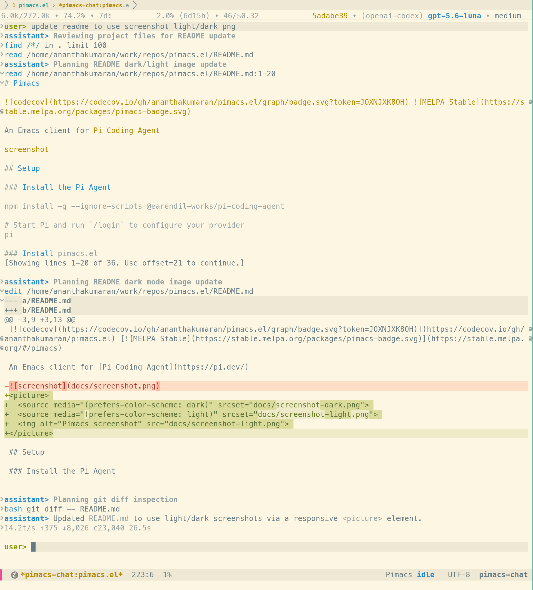

# Pimacs

[](https://codecov.io/gh/ananthakumaran/pimacs.el) [](https://stable.melpa.org/#/pimacs)

An Emacs client for [Pi Coding Agent](https://pi.dev/)

<picture>
  <source media="(prefers-color-scheme: dark)" srcset="docs/screenshot-dark.png">
  <source media="(prefers-color-scheme: light)" srcset="docs/screenshot-light.png">
  
</picture>

## Setup

### Install the Pi Agent

```bash
npm install -g --ignore-scripts @earendil-works/pi-coding-agent

# Start Pi and run `/login` to configure your provider
pi
```

### Install `pimacs.el`

Pimacs is available from [MELPA Stable](https://stable.melpa.org/), which is recommended for installation. Add it to your package archives, then install with `use-package`:

```elisp
(add-to-list 'package-archives
             '("melpa-stable" . "https://stable.melpa.org/packages/") t)

(use-package pimacs
  :ensure t)
```

## Usage

Run `M-x pimacs-chat` from any file in your project to start a Pimacs chat
session. Checkout [documentation](https://ananthakumaran.in/pimacs.el/)
for more details.
