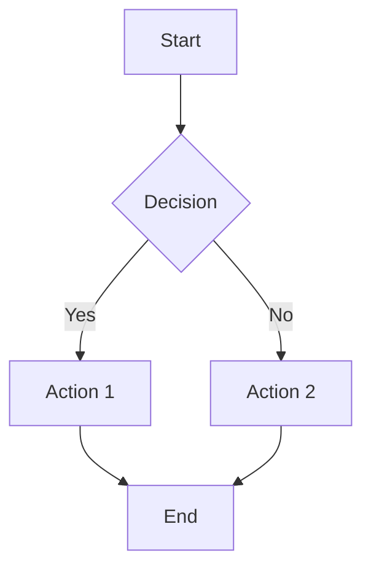
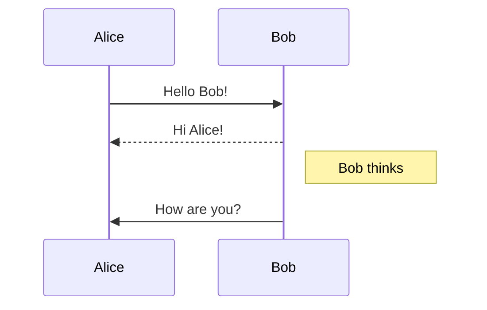
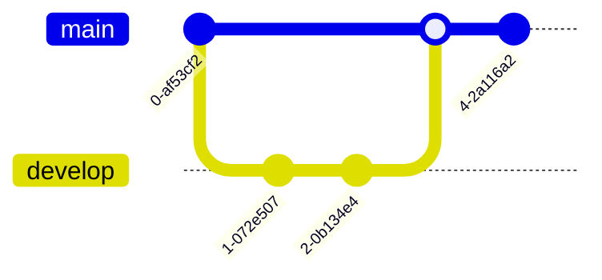

# Markdown Feature Test Document

A comprehensive test document for rendering markdown features.

---

## Table of Contents

1. [Headings](#headings)
2. [Text Formatting](#text-formatting)
3. [Lists](#lists)
4. [Links & Images](#links--images)
5. [Code](#code)
6. [Tables](#tables)
7. [Blockquotes](#blockquotes)
8. [Horizontal Rules](#horizontal-rules)
9. [Task Lists](#task-lists)
10. [Footnotes](#footnotes)
11. [Definition Lists](#definition-lists)
12. [Math](#math)
13. [HTML Embedding](#html-embedding)
14. [Admonitions/Callouts](#admonitionscallouts)
15. [Mermaid Diagrams](#mermaid-diagrams)

---

## Headings

# Heading 1 (H1)
## Heading 2 (H2)
### Heading 3 (H3)
#### Heading 4 (H4)
##### Heading 5 (H5)
###### Heading 6 (H6)

---

## Text Formatting

**Bold text** (double asterisk)
__Bold text__ (double underscore)

*Italic text* (single asterisk)
_Italic text_ (single underscore)

***Bold and Italic*** (triple asterisk)
___Bold and Italic___ (triple underscore)

~~Strikethrough~~ (tilde)

==Highlighted text== (equal signs - GitHub Flavored)

<sup>Superscript</sup>
<sub>Subscript</sub>

`Inline code` (backticks)

> **Note**: Some renderers may not support all extensions equally.

---

## Lists

### Unordered Lists

- Item 1
- Item 2
  - Nested item 2a
  - Nested item 2b
    - Deep nested item
  - Nested item 2c
- Item 3

* Alternative bullet (asterisk)
+ Alternative bullet (plus)
- Alternative bullet (dash)

### Ordered Lists

1. First item
2. Second item
   1. Nested ordered item
   2. Another nested item
3. Third item
4. Fourth item

### Mixed Lists

5. Ordered item
   - Unordered nested
   - Another unordered
6. Next ordered
   1. Ordered nested
   2. Another ordered

### List with Paragraphs

- Item with multiple paragraphs

  This is a second paragraph in the same list item.

- Another item
  - With a nested list
    - And deeper nesting

---

## Links & Images

### Links

[Simple link](https://example.com)

[Link with title](https://example.com "Example Domain")

[Reference-style link][ref-link]

[Relative link](../README.md)

[Email link](mailto:test@example.com)

[Anchor link](#tables)

[ref-link]: https://reference-example.com "Reference Link Title"

### Images


![Reference-style link title tooltip")

![Reference-style image][ref-image]

[ref-image]: https://via.placeholder.com/200x100 "Reference Image"

### Linked Images

[](https://example.com)

---

## Code

### Inline Code

Use `console.log("hello")` to print to console.

### Fenced Code Blocks

```javascript
// JavaScript example
function greet(name) {
  console.log(`Hello, ${name}!`);
}

greet("World");
```

```python
# Python example
def fibonacci(n):
    a, b = 0, 1
    for _ in range(n):
        yield a
        a, b = b, a + b

print(list(fibonacci(10)))
```

```rust
// Rust example
fn main() {
    let numbers = vec![1, 2, 3, 4, 5];
    let doubled: Vec<i32> = numbers.iter().map(|x| x * 2).collect();
    println!("{:?}", doubled);
}
```

```bash
# Shell commands
$ echo "Hello World"
$ ls -la
$ npm install
```

```json
{
  "name": "example",
  "version": "1.0.0",
  "dependencies": {
    "lodash": "^4.17.21"
  }
}
```

### Indented Code Blocks (4 spaces)

    // This is an indented code block
    function oldStyle() {
        return "indented";
    }

### Code Block with Line Numbers (if supported)

```javascript {1,3-5}
function highlightLines() {
  const a = 1; // Line 1
  const b = 2; // Line 2
  const c = 3; // Line 3 (highlighted)
  const d = 4; // Line 4 (highlighted)
  const e = 5; // Line 5 (highlighted)
  return a + b + c + d + e;
}
```

### Diff Code Blocks

```diff
- const oldValue = 'deprecated';
+ const newValue = 'improved';
  const unchanged = 'same';
```

---

## Tables

### Basic Table

| Column 1 | Column 2 | Column 3 |
|----------|----------|----------|
| Row 1    | Data     | More     |
| Row 2    | Data     | More     |
| Row 3    | Data     | More     |

### Table with Alignment

| Left Aligned | Center Aligned | Right Aligned |
|:-------------|:--------------:|--------------:|
| Left         | Center         | Right         |
| Data         | Data           | Data          |
| More         | Text           | Numbers       |

### Complex Table

| Feature | Supported | Notes |
|---------|:---------:|-------|
| Headers | ✅ | Standard |
| Alignment | ✅ | Left/Center/Right |
| Multi-line cells | ⚠️ | Limited support |
| Colspan/Rowspan | ❌ | Not in standard Markdown |
| HTML in cells | ✅ | If enabled |

### Table with Code and Formatting

| Language | Example | **Bold** | *Italic* |
|----------|---------|----------|----------|
| JS | `const x = 1;` | **Yes** | *Yes* |
| Python | `x = 1` | **Yes** | *Yes* |
| Rust | `let x = 1;` | **Yes** | *Yes* |

---

## Blockquotes

> Simple blockquote
>
> Multiple paragraphs in a blockquote.

> **Blockquote with formatting**
>
> - List item 1
> - List item 2
>
> > Nested blockquote
> >
> > Deep nesting

> ### Blockquote with Heading
>
> Content here.

> [!NOTE]
> This is a GitHub-style callout (note)

> [!WARNING]
> This is a warning callout

> [!TIP]
> This is a tip callout

> [!IMPORTANT]
> This is an important callout

---

## Horizontal Rules

***

---

___

---

## Task Lists

- [x] Completed task
- [ ] Incomplete task
- [x] Another completed task
  - [ ] Nested incomplete
  - [x] Nested complete
- [ ] Task with **bold** and *italic*

---

## Footnotes

Here's a sentence with a footnote[^1].

Another sentence with a different footnote[^longnote].

[^1]: This is the first footnote.

[^longnote]: This is a longer footnote with multiple paragraphs.

    Indented paragraph in the footnote.

    Another paragraph.

---

## Definition Lists

Term 1
: Definition for term 1

Term 2
: Definition for term 2
: Another definition for term 2

Term 3
:   Definition with multiple paragraphs.

    Second paragraph.

---

## Math

### Inline Math

The quadratic formula is $x = \frac{-b \pm \sqrt{b^2 - 4ac}}{2a}$.

Euler's identity: $e^{i\pi} + 1 = 0$.

### Block Math

$$
\int_{-\infty}^{\infty} e^{-x^2} dx = \sqrt{\pi}
$$

$$
\begin{aligned}
\nabla \times \vec{E} &= -\frac{\partial \vec{B}}{\partial t} \\
\nabla \times \vec{B} &= \mu_0 \vec{J} + \mu_0 \epsilon_0 \frac{\partial \vec{E}}{\partial t}
\end{aligned}
$$

---

## HTML Embedding

<div style="background-color: #f0f0f0; padding: 10px; border-radius: 5px;">
  <strong>Custom HTML div</strong> with inline styles.
</div>

<details>
<summary>Click to expand</summary>
This content is hidden by default.
</details>

<kbd>Ctrl</kbd> + <kbd>C</kbd> to copy

---

## Admonitions/Callouts

> [!NOTE]
> Useful information that users should know, even when skimming.

> [!TIP]
> Helpful advice for doing things better or more easily.

> [!IMPORTANT]
> Key information users need to know to achieve their goal.

> [!WARNING]
> Urgent info that needs immediate attention to avoid problems.

> [!CAUTION]
> Risks or negative consequences of certain actions.

> [!NOTE]
> ### Admonition with Title
>
> Content with **formatting**, `code`, and [links](https://example.com).
>
> - List item 1
> - List item 2

---

## Mermaid Diagrams

### Flowchart



### Sequence Diagram



### Class Diagram

```mermaid
classDiagram
    Animal <|-- Dog
    Animal <|-- Cat
    Animal: +name: String
    Animal: +makeSound()
    Dog: +breed: String
    Cat: +color: String
```

### Git Graph



---

## Additional Edge Cases

### Escaping Characters

\*Not italic\*
\# Not a heading
\[Not a link\](http://example.com)
\`Not code\`

### Unicode & Special Characters

Emoji: 🎉 🚀 💻 🎯 ✨

Arrows: ← ↑ → ↓ ↔ ⇐ ⇑ ⇒ ⇓ ⇔

Symbols: © ® ™ § ¶ † ‡ • … ‰ ′ ″

Math: ∑ ∏ ∫ ∂ √ ∞ ≈ ≠ ≤ ≥ ± ÷ ×

### Very Long Line Test

This is a very long line that should test how the renderer handles text wrapping and horizontal scrolling when the content exceeds the viewport width. It contains no natural break points and should demonstrate whether the renderer implements proper word wrapping or requires horizontal scrolling.

### Empty Elements

Paragraph before empty line.

Paragraph after empty line.

---

## Raw HTML Blocks

<table>
  <tr>
    <th>HTML Table</th>
    <th>Header 2</th>
  </tr>
  <tr>
    <td>Cell 1</td>
    <td>Cell 2</td>
  </tr>
</table>

---

## Comments

<!-- This is an HTML comment -->
<!--
  Multi-line comment
  spanning multiple lines
-->

---

*End of test document. Generated for markdown rendering verification.*
